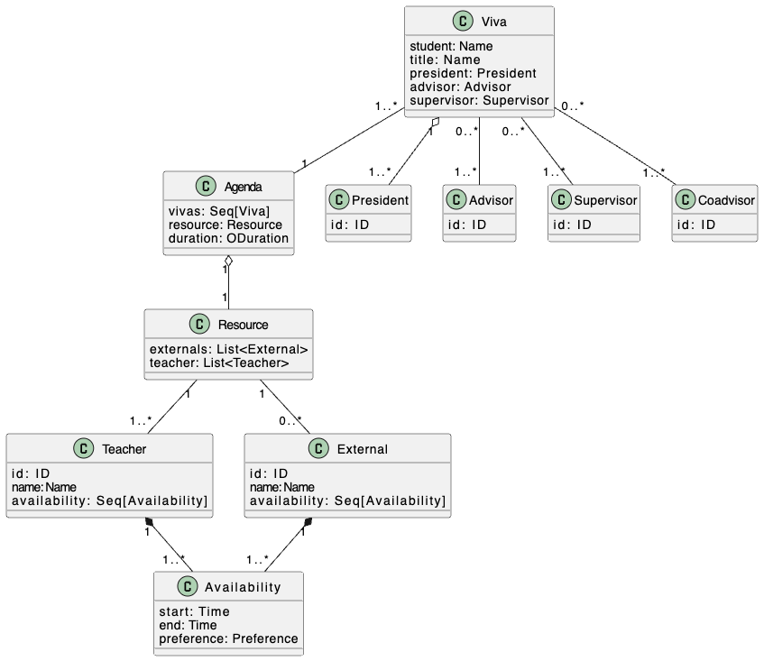

# The Viva to be Scheduled Problem

## Index

- [The Viva to be Scheduled Problem](#the-viva-to-be-scheduled-problemhe)
  - [Domain Model]()
  - [The Problem](#the-problem)
  - [Objective](#objective)
  - [MS01 Summary](#ms01-summary)

## Domain Model

The domain was created based on an analysis conducted on the input XML files for the problem's use case. 
The domain classes consist of Agenda, Viva, and Resources, which comprises a list of Teachers and Externals.

Both Teachers and Externals have availabilities that include start and end datetime, as well as the subject's preferences. 
The Resources class was introduced to combine both Externals and Teachers, providing a unified structure for managing resource's availability.
      
## The Problem

This repository serves as the central hub for both the documentation and the source code of the project crafted for the "Técnicas Avançadas de Programação" (Advanced Programming Techniques) course, which is part of the Master’s in Computer Engineering curriculum at the Instituto Superior de Engenharia do Porto (ISEP).
The challenge at hand involves the intricate scheduling of Master of Science (MSc) dissertation defenses, also known colloquially and in academic terms as "viva," from the Latin "viva voce," meaning "by live voice." This scheduling endeavor includes multiple stakeholders, each viva needing to be arranged at the most opportune time within the confines of existing scheduling constraints. Moreover, within a specified time frame, numerous vivas need coordination, with various participants often being involved in multiple defenses.

This problem is classified as NP-hard, indicating that in its unconstrained form, it is intractable. However, applying specific constraints related to the availability of the involved entities (resources) can render the problem manageable, or "tractable." The initial phase of this project, which marks the first milestone, will start by addressing only a subset of these constraints. As the project progresses through its phases, particularly in milestones M1 and M3, it will gradually incorporate more constraints and refine the algorithms designed to optimize the scheduling process. These algorithms aim to progressively enhance the quality and feasibility of the scheduling solutions, illustrating a methodical approach to tackling this complex problem.

## Objective
The main objective of this work is the design and development of an application using functional
programming techniques.

## MS01 Summary
(TODO) - explain the algorithm
