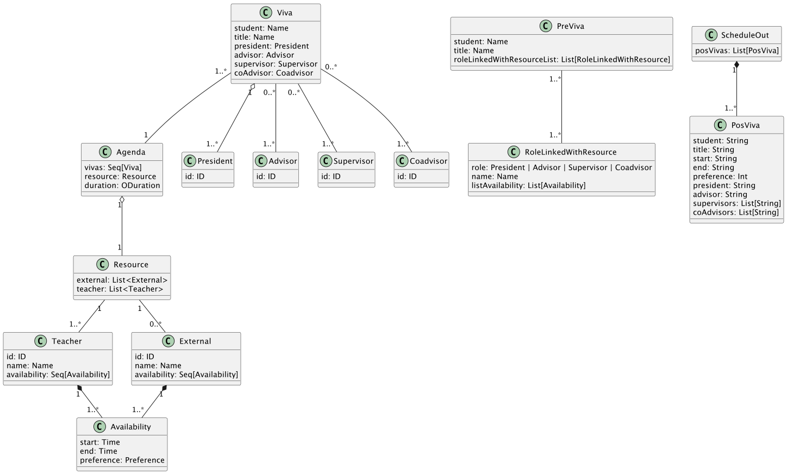
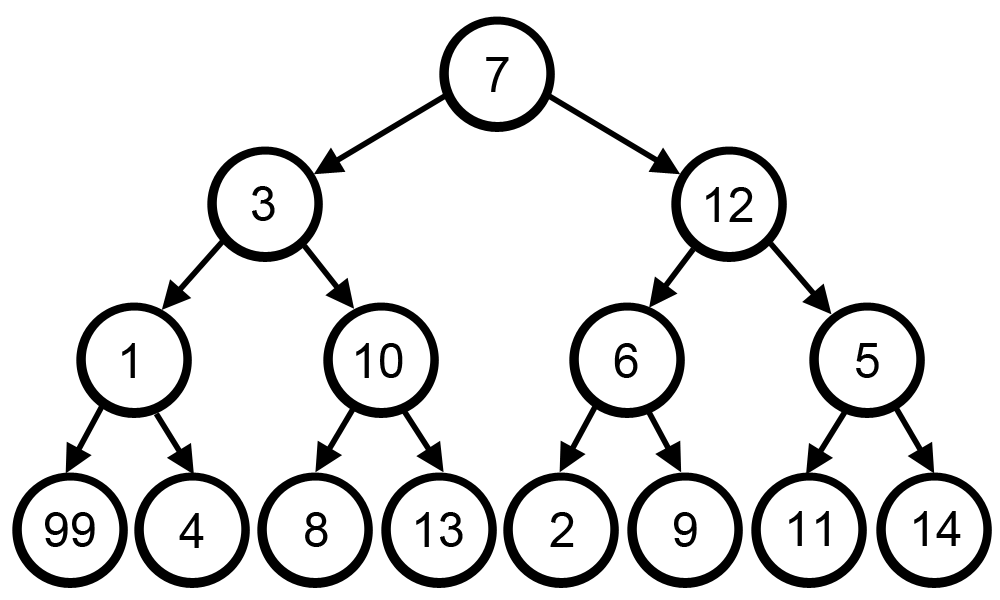

# The Viva to be Scheduled Problem

## Index

- [The Viva to be Scheduled Problem](#the-viva-to-be-scheduled-problem)
    - [The Problem](#the-problem)
    - [Domain Model](#domain-model)
        - [Entities and Attributes](#entities-and-attributes)
        - [Relationships Between Entities](#relationships-between-entities)
    - [Objective](#objective)
    - [Milestones Development Process](#milestones-development-process)
        - [MS01 - First Come First Served](#ms01---first-come-first-served)
            - [Overview](#overview)
            - [Approach](#approach)
            - [Steps](#steps)
            - [Error Handling](#error-handling)
            - [Unit Tests](#unit-tests)
            - [Functional Tests](#functional-tests)
        - [MS02 - Property-based Tests](#ms02---property-based-tests)
            - [Property Tests](#property-tests)
                - [ScheduleTest](#scheduletest)
                - [ResourceCannotBeOverlapped](#resourcecannotbeoverlapped)
                - [No Availability Overpasses the Day](#no-availability-overpasses-the-day)
                - [Each External and Teacher Has at Least One Availability from the List](#each-external-and-teacher-has-at-least-one-availability-from-the-list)
                - [Each PreViva in the Generated List is Valid](#each-previva-in-the-generated-list-is-valid)
                - [No list of PreVivas is empty](#no-list-of-previvas-is-empty)
                - [Each PreViva Contains at Least One Availability from availListGenerated](#each-previva-contains-at-least-one-availability-from-availlistgenerated)
                - [Each Viva Has Unique IDs Across President, Advisor, Supervisors, and CoAdvisors](#each-viva-has-unique-ids-across-president-advisor-supervisors-and-coadvisors)
            - [VivaTest](#vivatest)
            - [IDTest](#idtest)
            - [linkVivaWithResourceTest](#linkvivawithresourcetest)
            - [MS01_Algorithm](#ms01_algorithm)
            - [PreVivaTest](#previvatest)
            - [updateAvailabilitySlotsTest](#updateavailabilityslotstest)
        - [MS03 - Preference Maximization](#ms03---preference-maximization)
            - [Approach](#approach-1)
            - [Steps](#steps-1)
            - [Error Handling](#error-handling-1)
            - [Unit Tests](#unit-tests-1)
            - [Functional Tests](#functional-tests-1)
            - [Conclusion](#conclusion)

## The Problem

This repository serves as the central hub for both the documentation and the source code of the project crafted for
the "Técnicas Avançadas de Programação" (Advanced Programming Techniques) course, which is part of the Master’s in
Computer Engineering curriculum at the Instituto Superior de Engenharia do Porto (ISEP).
The challenge at hand involves the intricate scheduling of Master of Science (MSc) dissertation defenses, also known
colloquially and in academic terms as "viva," from the Latin "viva voce," meaning "by live voice." This scheduling
endeavor includes multiple stakeholders, each viva needing to be arranged at the most opportune time within the confines
of existing scheduling constraints. Moreover, within a specified time frame, numerous vivas need coordination, with
various participants often being involved in multiple defenses.

This problem is classified as NP-hard, indicating that in its unconstrained form, it is intractable. However, applying
specific constraints related to the availability of the involved entities (resources) can render the problem manageable,
or "tractable." The initial phase of this project, which marks the first milestone, will start by addressing only a
subset of these constraints. As the project progresses through its phases, particularly in milestones M1 and M3, it will
gradually incorporate more constraints and refine the algorithms designed to optimize the scheduling process. These
algorithms aim to progressively enhance the quality and feasibility of the scheduling solutions, illustrating a
methodical approach to tackling this complex problem.

## Domain Model

The domain was created based on an analysis conducted on the input XML files for the problem's use case.

### Entities and Attributes

1. **Viva**
    - Attributes:
        - `student: Name` - Name of the student.
        - `title: Name` - Title of the thesis.
        - `president: President` - President of the committee.
        - `advisor: Advisor` - Advisor of the thesis.
        - `supervisor: Supervisor` - Supervisor of the thesis.
        - `coAdvisor: Coadvisor` - Co-advisor of the thesis.

2. **Agenda**
    - Attributes:
        - `vivas: Seq[Viva]` - Sequence of scheduled thesis defenses (vivas).
        - `resource: Resource` - Allocated resources.
        - `duration: ODuration` - Duration of the defense.

3. **Resource**
    - Attributes:
        - `external: List<External>` - List of external participants.
        - `teacher: List<Teacher>` - List of teachers.

4. **Teacher**
    - Attributes:
        - `id: ID` - Identifier of the teacher.
        - `name: Name` - Name of the teacher.
        - `availability: Seq[Availability]` - Availability of the teacher.

5. **External**
    - Attributes:
        - `id: ID` - Identifier of the external participant.
        - `name: Name` - Name of the external participant.
        - `availability: Seq[Availability]` - Availability of the external participant.

6. **Availability**
    - Attributes:
        - `start: Time` - Start time.
        - `end: Time` - End time.
        - `preference: Preference` - Time preference.

7. **PreViva**
    - Attributes:
        - `student: Name` - Name of the student.
        - `title: Name` - Title of the thesis.
        - `roleLinkedWithResourceList: List[RoleLinkedWithResource]` - List of roles linked with resources.

8. **RoleLinkedWithResource**
    - Attributes:
        - `role: President | Advisor | Supervisor | Coadvisor` - Role (President, Advisor, Supervisor, Co-advisor).
        - `name: Name` - Name of the person.
        - `listAvailability: List[Availability]` - List of availabilities.

9. **ScheduleOut**
    - Attributes:
        - `posVivas: List[PosViva]` - List of scheduled post-defenses.

10. **PosViva**
    - Attributes:
        - `student: String` - Name of the student.
        - `title: String` - Title of the thesis.
        - `start: String` - Start time.
        - `end: String` - End time.
        - `preference: Int` - Time preference.
        - `president: String` - President of the committee.
        - `advisor: String` - Advisor of the thesis.
        - `supervisors: List[String]` - List of supervisors.
        - `coAdvisors: List[String]` - List of co-advisors.

### Relationships Between Entities
- **Viva** is related to **Agenda** through a composition relationship, where an agenda can have multiple vivas.
- **Agenda** is related to **Resource**, indicating that each agenda uses a set of resources.
- **Resource** is related to **Teacher** and **External**, indicating that resources include both teachers and external participants.
- **Teacher** and **External** are related to **Availability**, indicating the availability of these resources.
- **PreViva** and **RoleLinkedWithResource** manage specific roles linked to resources and their availabilities before the defense is scheduled.
- **ScheduleOut** and **PosViva** handle the output of the defense scheduling, detailing the final schedule.

## Objective

The main objective of this work is the design and development of an application using functional
programming techniques.

## Milestones Development Process

<strong>MS01 - First Come First Served</strong>

### MS01 - First Come First Served

#### Overview

The initial milestone of our project was developed using the Test Driven Development (TDD) methodology, a strategy
particularly beneficial at the onset when the domain model concepts were still being defined and no code base existed.
To foster robust development and minimize potential bugs from the outset, we prioritized writing unit tests that
verified the accuracy and stability of our domain model before beginning the actual coding.
Starting with these tests allowed us to mitigate possible bugs and clearly define the expected functionality of the
code.
This approach not only facilitated a clearer development process but also helped maintain the integrity of the domain
model throughout the project’s progression.
By continuously updating and referring to our comprehensive suite of unit tests, we were able to quickly identify and
rectify defects arising from recent changes, ensuring a stable and reliable codebase.

The Classes were created in the `io` package for reading XML files and loading data into memory.
In this milestone, a minimum viable product (MVP) is expected. The generation of the viva schedule happens in a
First Come First Served (FCFS) manner relative to the input file. Each viva is to be scheduled to the first date/time
in which all its resources are available. The schedule will be successful if all the vivas can be scheduled and fail
otherwise.

#### Approach

The implementation of the FCFS algorithm involves scheduling each viva to the earliest available date and time when all
required resources are available. This process is performed iteratively for each viva in the order they appear in the
input list.

#### Steps

1. **Extract Resources and Duration**: The algorithm starts by extracting the list of teachers, external participants,
and the duration of each viva from the provided agenda.

2. **PreViva Creation**: For each viva, a `PreViva` object is created. This object links the viva with the necessary
resources (teachers and external participants).

3. **First Come First Served Scheduling**:
    - The algorithm iterates over each `PreViva` object.
    - For each `PreViva`, it checks the availability of all required resources.
    - It updates the list of used slots based on the previously scheduled vivas to ensure no resource is double-booked.
    - It identifies all possible time slots where the viva can be scheduled, taking into account the duration and
availability of resources.
    - It selects the first available slot that satisfies all requirements and schedules the viva in that slot.

4. **Result Compilation**: The scheduled vivas are compiled into a `ScheduleOut` object. If any viva cannot be scheduled
due to resource constraints, the scheduling process fails.

#### Error Handling

The algorithm includes error handling to manage situations where it is impossible to schedule a viva due to resource
unavailability. In such cases, it returns an appropriate error message indicating the failure to complete the schedule.

#### Unit Tests

Unit tests are created to verify the correctness of individual components of the algorithm. These tests ensure that:
- The availability of resources is correctly identified and updated.
- The `PreViva` objects are accurately linked with the required resources.
- The scheduling logic correctly identifies and selects the first available slot for each viva.

#### Functional Tests

Functional tests validate the overall functionality of the scheduling algorithm. These tests involve running the
algorithm with sample input data and verifying that the output schedule meets all requirements.
Scenarios tested include:
- Successful scheduling of all vivas with sufficient resource availability.
- Handling of cases where some vivas cannot be scheduled due to resource constraints.

<strong>MS02 - Property-based Tests</strong>

### MS02 - Property-based Tests

The primary objective of this second milestone is to develop property tests using ScalaCheck to ensure the algorithm's properties are functioning as intended. In addition to verifying the algorithm's performance, this milestone also aims to highlight the issues associated with the first come, first served algorithm that was developed in the first milestone. This dual focus will not only validate the current implementation but also provide critical insights into the limitations and potential improvements for the initial algorithm.

The use of generators and property-based testing in software development offers numerous advantages in terms of both
efficiency and code quality.
Generators allow for the creation of iterators that produce values on demand without the need to store all values in
memory, resulting in more efficient memory usage and improved performance, especially when handling large volumes of
data.
Additionally, they simplify and enhance the readability of the code. Property-based testing, on the other hand, focuses
on defining properties that function outputs must satisfy and automatically generates numerous test cases to verify
these properties.
This significantly expands test coverage, helping to identify bugs that would not be discovered through traditional
testing methods.
This systematic approach explores various usage scenarios and edge case inputs, documents the expected behavior of the
system, and facilitates code comprehension and maintenance.
Combining these techniques leads to more robust, reliable, and maintainable software, substantially improving
development and testing processes and ensuring the delivery of high-quality software.

#### Property tests

1. **ScheduleTest**
    - **All the viva must be scheduled in the intervals in which its resources are available**
   
    
    - This test ensures that all vivas are scheduled only within the intervals when the required resources are available. It uses generators to create a list of PreViva (pre-viva) and their respective durations. The generatePossibleSchedule method creates a possible schedule using the algorithmFCFS (First-Come, First-Served) algorithm.
    - The test then checks each scheduled viva (posViva) in the generated schedule. For each viva, it finds the corresponding PreViva in the original list of pre-vivas. It then validates that the time interval of the posViva (start and end) matches at least one of the availabilities of the resources linked to the specific role in the PreViva. 
    - If all scheduled vivas are within the availability intervals of their resources, the test passes. Otherwise, it fails, ensuring that the scheduling algorithm respects the availability constraints of the resources.
    

2. **ResourceCannotBeOverlapped**
    - **One resource cannot be overlapped in two scheduled viva**
   
    
    -  This test ensures that no single resource is scheduled to be in two vivas at the same time. It uses generators to create a possible schedule of vivas with their respective durations. The generatePossibleSchedule method generates this schedule using the algorithmFCFS (First-Come, First-Served) algorithm. 
    - The test defines an intervalsOverlap function to check if two time intervals overlap. It then iterates over each scheduled viva (posViva) in the generated schedule. For each viva, it extracts the start and end times and compares them with the start and end times of all other vivas in the schedule. 
    - The test ensures that no two vivas have overlapping intervals, validating that each resource is only allocated to one viva at a time. If all vivas do not overlap in time, the test passes. Otherwise, it fails, ensuring the scheduling algorithm respects the non-overlapping constraint for resources.

3. **No Availability Overpasses the Day**
    - **Ensuring no Availability interval overpasses a single day**
    - This test ensures that all availability intervals for resources do not extend beyond a single day. It uses generators to create availabilities for a specific day. The `generateAvailabilityFromDay` method generates these availabilities, ensuring they start and end within the same day.
    - The test checks each generated availability interval to verify that the start and end times are on the same day. It validates that no interval crosses over to the next day.
    - If all availabilities are within the same day, the test passes. Otherwise, it fails, ensuring the availability constraints are respected and do not span multiple days.

4. **Each External and Teacher Has at Least One Availability from the List**
    - This property test ensures that every teacher and external involved in the viva scheduling has at least one availability period from a predefined list of availability intervals. The test uses generators to create a valid agenda for the viva process, including lists of vivas, teachers, externals, and their respective availabilities.

5. **Each PreViva in the Generated List is Valid**
    - This property test ensures that each PreViva in the generated list is valid. It uses generators to create lists of PreViva, their durations, and corresponding availability lists.
    - The test checks that the length of the preVivaList is equal to the length of the availList. This ensures that each PreViva has a corresponding availability, validating the integrity of the generated data.
    - If all PreVivas in the list have matching availabilities, the test passes. Otherwise, it fails, ensuring data consistency in the generated lists.
   

6. **No list of PreVivas is empty**
    - This property test ensures that no list of PreVivas is empty. It uses generators to create lists of PreVivas, their durations, and corresponding availability lists.
    - The test checks that both preVivaList and availList are non-empty. This ensures that there are always valid PreVivas and availabilities generated for scheduling.
    - If both lists are non-empty, the test passes. Otherwise, it fails, ensuring that the scheduling process always has data to work with.

7. **Each PreViva Contains at Least One Availability from availListGenerated**
    - This property test ensures that each PreViva contains at least one availability from the generated availability list. It uses generators to create lists of PreVivas, their durations, and corresponding availability lists.
    - The test checks that each PreViva has at least one availability from the availListGenerated. This ensures that every PreViva can potentially be scheduled within the available intervals.
    - If each PreViva has at least one matching availability, the test passes. Otherwise, it fails, ensuring that the generated PreVivas are schedulable within the given availability constraints.

8. **Each Viva Has Unique IDs Across President, Advisor, Supervisors, and CoAdvisors**
    - This property test ensures that each viva has unique IDs across all assigned roles, including President, Advisor, Supervisors, and CoAdvisors. It uses generators to create a list of vivas, each with their respective roles and IDs.
    - The test collects all IDs associated with each viva, including the President, Advisor, Supervisors, and CoAdvisors. It then checks that all IDs are unique within the same viva.
    - If all IDs within a viva are unique, the test passes. Otherwise, it fails, ensuring that no duplicate IDs exist across the different roles in a viva.

#### VivaTest

- **generatePresident**: Generates a `President` ID that is not already in the provided list of IDs. Ensures unique ID assignment for the President role.
- **generateAdvisor**: Generates an `Advisor` ID that is not already in the provided list of IDs. Ensures unique ID assignment for the Advisor role.
- **generateCoAdvisor**: Generates a `CoAdvisor` ID from either teacher or external IDs that is not already in the provided list of IDs. Ensures unique ID assignment for the CoAdvisor role.
- **generateSupervisor**: Generates a `Supervisor` ID from external IDs that is not already in the provided list of IDs. Ensures unique ID assignment for the Supervisor role.
- **generateSupervisorList**: Generates a list of `Supervisors` from a list of IDs, ensuring no duplicates within the list. Uses a recursive helper function to build the list.
- **generateCoAdvisorList**: Generates a list of `CoAdvisors` from a list of IDs, ensuring no duplicates within the list. Uses a recursive helper function to build the list.
- **generateViva**: Generates a `Viva` instance by creating unique IDs for all roles (President, Advisor, Supervisors, CoAdvisors) and returns the `Viva` object along with the list of used IDs.
- **generateVivaList**: Generates a list of `Viva` instances of a specified size, ensuring each `Viva` has unique IDs for all roles.
- **Properties**:
    - **Each Viva in List doesn't have the same President and Advisor**: Validates that the President and Advisor roles in each `Viva` have unique IDs.
    - **No Supervisors have the same ID within a Viva**: Ensures that there are no duplicate Supervisor IDs within each `Viva`.
    - **No CoAdvisors have the same ID within a Viva**: Ensures that there are no duplicate CoAdvisor IDs within each `Viva`.
    - **Each Viva has unique IDs across President, Advisor, Supervisors, and CoAdvisors**: Confirms that all IDs within a `Viva` are unique across all roles.

#### IDTest

- **generateID**: Generates a general `ID` with a prefix of either "T" for Teacher or "E" for External followed by a 3-digit number. Validates the correctness of the generated ID.
- **generateTeacherID**: Generates a `TeacherID` with a prefix "T" followed by a 3-digit number. Ensures the generated ID conforms to the Teacher ID format.
- **generateExternalID**: Generates an `ExternalID` with a prefix "E" followed by a 3-digit number. Ensures the generated ID conforms to the External ID format.
- **generateUniqueIDs**: Generates a list of unique `IDs` up to a specified maximum number, ensuring there are no duplicates.
- **generateTeacherIdThatsNotOnList**: Generates a `TeacherID` that is not in the provided list of IDs. Ensures unique ID assignment.
- **generateExternalIdThatsNotOnList**: Generates an `ExternalID` that is not in the provided list of IDs. Ensures unique ID assignment.
- **generateIDThatsNotOnList**: Generates a general `ID` that is not in the provided list of IDs. Ensures unique ID assignment.
- **Properties**:
    - **IDs are in the correct format**: Validates that all generated `IDs` conform to the expected format.
    - **Teacher IDs are in the correct format**: Ensures that all generated `TeacherIDs` are valid and conform to the expected format.
    - **External IDs are in the correct format**: Ensures that all generated `ExternalIDs` are valid and conform to the expected format.
    - **IDs are unique**: Checks that the generated list of `IDs` contains only unique entries, with no duplicates.
    - **Teacher IDs are unique**: Ensures that all `TeacherIDs` in the generated list are unique.
    - **External IDs are unique**: Ensures that all `ExternalIDs` in the generated list are unique.

#### linkVivaWithResourceTest

- **generateVivaWithTeachersAndExternals**: Generates a `Viva` object along with lists of `Teacher` and `External` objects based on a given day. Ensures that IDs are properly assigned and do not overlap.
- **generateAValidAgendaViva**: Generates a list of `Viva` objects, lists of `Teacher` and `External` objects, and a duration, ensuring that all generated entities are valid and consistent with each other.
- **Properties**:
    - **all generated teacher and external IDs should be present in the list of IDs from Viva**: Ensures that all generated teacher and external IDs are included in the `Viva` object, maintaining consistency between the `Viva` and the resources.
    - **the lengths of generated lists should match the number of distinct IDs**: Verifies that the lengths of generated teacher and external ID lists match the number of distinct IDs, ensuring no duplication.
    - **Testing linkVivaWithResource**: A placeholder property to ensure that the `generateAValidAgendaViva` function works as expected, producing valid and consistent data.

#### MS01_Algorithm

- **generatePossibleSchedule**: Generates a possible schedule (`ScheduleOut`) by creating a list of `PreViva` objects, calculating their duration, and generating a schedule using the `algorithm` function. Ensures that the scheduling algorithm produces valid outputs.
- **Properties**:
    - **Putting the generated PreVivas in the algorithm**: Ensures that the generated schedule does not have overlapping `PosViva` intervals. Converts `start` and `end` strings to `OTime` objects and verifies that no two intervals overlap, ensuring the correctness of the scheduling algorithm.

#### PreVivaTest

- **generatePreVivaList**: Generates a list of `PreViva` objects along with an `ODuration`. Utilizes a valid agenda to create linked viva sessions and resources.
- **Properties**:
    - **PreViva objects are correctly linked**: Validates that all generated `PreViva` objects are correctly linked with resources.
    - **PreViva objects have valid duration**: Ensures that all generated `PreViva` objects conform to the specified duration format.
    - **PreViva lists are unique**: Checks that the generated list of `PreViva` objects contains only unique entries, with no duplicates.
    - **PreViva objects conform to requirements**: Ensures that all generated `PreViva` objects meet the necessary requirements and constraints.

#### updateAvailabilitySlotsTest

- **createODuration**: Helper method to create an `ODuration` from hours, minutes, and seconds. Validates the format and correctness of the duration string.
- **nonEmptyAvailabilityList**: Generates a non-empty list of `Availability` objects, ensuring there is always at least one availability slot.
- **generateDuration**: Generates an `ODuration` by selecting random hours, minutes, and seconds, and ensures the generated duration is valid.
- **nonEmptyUsedSlotsList**: Generates a non-empty list of used availability slots, ensuring there is always at least one used slot.
- **updateAvailabilitySlots**: Property test that verifies the `updateAvailabilitySlots` function correctly updates availability slots based on used slots and a given duration. Ensures no overlaps in updated slots, all updated slots meet the minimum duration requirement, all used slots are reflected in the updated slots, original slots are included when there are no used slots, and all original availabilities are considered.
- **Properties**:
    - **No overlaps in updated slots**: Validates that the updated availability slots do not overlap with each other.
    - **Valid duration for all updated slots**: Ensures that all updated slots meet the minimum duration requirement.
    - **All used slots are reflected in updated slots**: Ensures that all used slots are properly accounted for in the updated slots.
    - **Original slots included when no used slots**: Verifies that original availability slots are included in the updated slots when there are no used slots.
    - **All availabilities are considered**: Ensures that all original availability slots are taken into account when updating the slots.

<strong>MS03 - Preference Maximization</strong>

### MS03 - Preference Maximization

This milestone incorporates the preferences of all resources involved in scheduling a viva and aims to produce a
schedule that maximizes the total preferences of all the elements for every viva. It is important to note that
maximizing the preference for each individual viva does not necessarily lead to an overall maximization of total
preferences. Sometimes, allowing one viva to not be at its maximum preference can enable several others to achieve
better preference values. Unit and functional tests should be produced for this milestone.

#### Approach

The implementation of the Preference Maximization algorithm involves scheduling vivas in a manner that maximizes the
total preferences across all resources. The process is designed to evaluate and choose the best global schedule rather
than focusing on individual preferences.

To address this need, we decided to implement the `greedy algorithm`.

A `greedy algorithm` is a form of optimization algorithm that iteratively makes the locally optimal choice with the
objective of finding a globally optimal solution. This algorithm operates on the principle of selecting the best
immediate option without taking into account the potential long-term repercussions.

`Greedy algorithms` are often used in various fields such as operations research, computer science, and economics,
where they can provide efficient solutions for problems that can be broken down into smaller, manageable sub-problems.

#### Steps

1. **Extract Resources and Duration**: The algorithm starts by extracting the list of teachers, external participants,
and the duration of each viva from the provided agenda.

2. **PreViva Creation**: For each viva, a `PreViva` object is created. This object links the viva with the necessary
resources (teachers and external participants).

3. **Global Greedy Scheduling**:
    - The algorithm generates all possible schedules for the remaining vivas, taking into account the used slots and the
required duration.
    - It evaluates each potential schedule based on the total preferences and selects the best one.
    - The chosen schedule is then used to update the list of scheduled vivas and the used slots.
    - This process is repeated recursively until all vivas are scheduled or it is determined that scheduling is
impossible.

4. **Result Compilation**: The scheduled vivas are compiled into a `ScheduleOut` object. If any viva cannot be scheduled
due to resource constraints, the scheduling process fails.

#### Error Handling

The algorithm includes error handling to manage situations where it is impossible to schedule a viva due to resource 
unavailability. In such cases, it returns an appropriate error message indicating the failure to complete the schedule.

#### Unit Tests

Unit tests are created to verify the correctness of individual components of the algorithm. These tests ensure that:
- The availability of resources is correctly identified and updated.
- The `PreViva` objects are accurately linked with the required resources.
- The scheduling logic correctly identifies and selects the best possible slot based on total preferences for each viva.

#### Functional Tests

Functional tests validate the overall functionality of the scheduling algorithm. These tests involve running the
algorithm with sample input data and verifying that the output schedule maximizes the total preferences. Scenarios
tested include:
- Successful scheduling of all vivas with optimal resource preference maximization.
- Handling of cases where some vivas cannot be scheduled due to resource constraints.

#### Conclusion

Milestone 3 represents a significant enhancement in the viva scheduling system by incorporating preference maximization
for all involved resources. The developed algorithm shifts from a simple First Come First Served approach to a more
sophisticated method that evaluates and optimizes the overall satisfaction of preferences across all scheduling
elements. This transition ensures a more efficient and effective scheduling process that balances the needs and
preferences of students, teachers, and external participants.
The implementation of the global `greedy algorithm` allows for a comprehensive evaluation of all possible schedules,
ensuring that the selected schedule maximizes total preferences while still respecting the constraints of resource
availability and duration requirements. This approach acknowledges that achieving the highest preference for individual
vivas may not always lead to the best overall schedule, and thus, it intelligently balances individual and collective
preferences.
The inclusion of rigorous unit and functional tests underscores the robustness and reliability of the solution.
Unit tests verify the correctness of each component, ensuring that resource availabilities are accurately identified
and updated, and that `PreViva` objects are correctly linked with necessary resources. Functional tests validate the
algorithm's ability to produce an optimal schedule that maximizes total preferences, even in complex scenarios where 
resources are limited or heavily contested.
In summary, the preference maximization algorithm developed in Milestone 3 offers a sophisticated and practical
solution for scheduling thesis defenses. It ensures a high level of satisfaction for all participants by optimizing
the use of available resources and respecting individual preferences. The result is a more balanced and efficient
scheduling system that meets the needs of the academic community while enhancing the overall scheduling experience.

